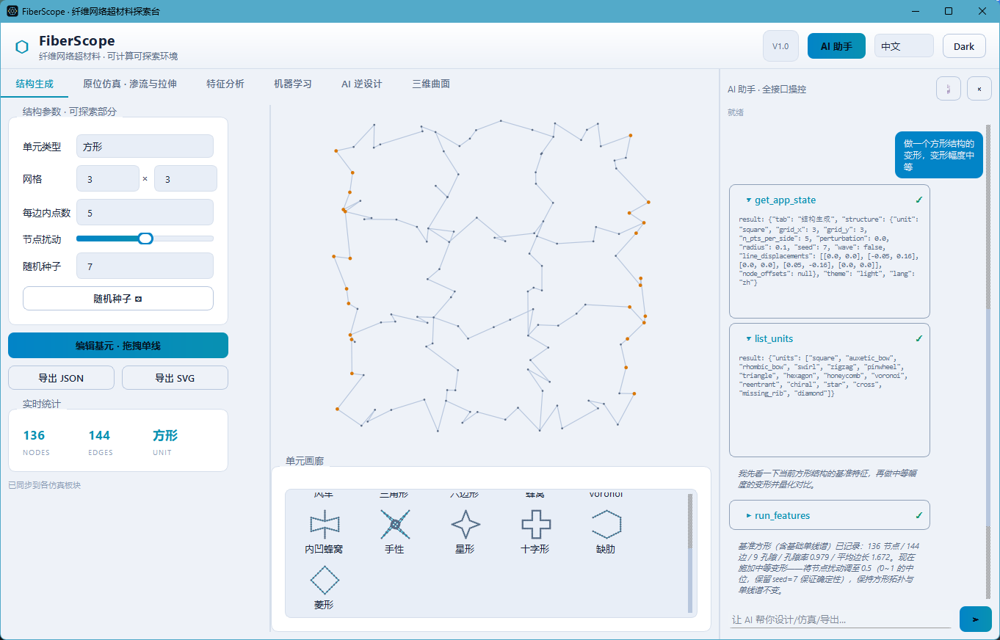
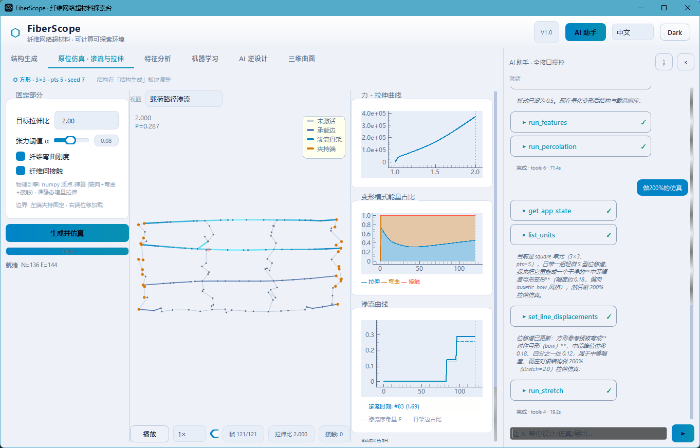
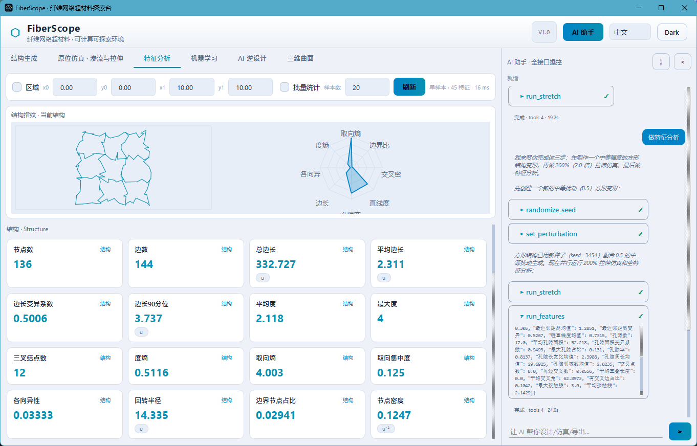
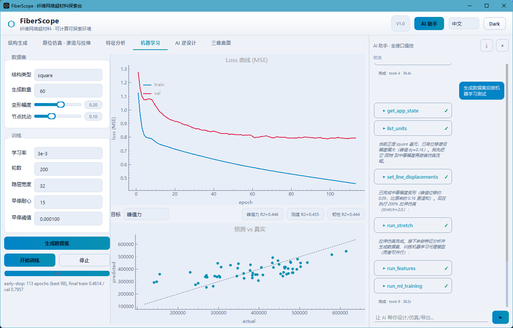
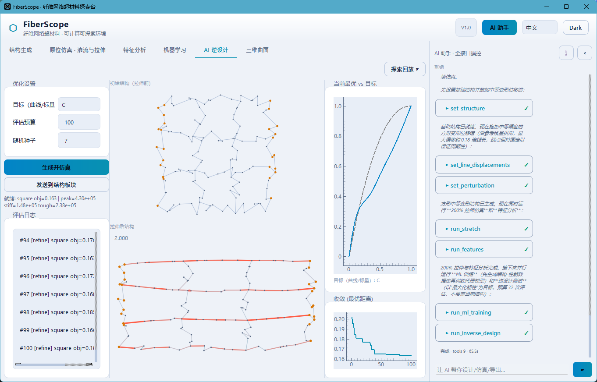
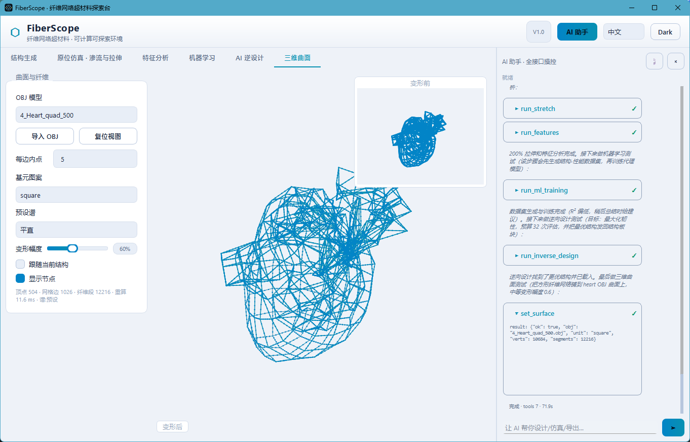

# FiberScope V1.0 · 纤维网络超材料交互探索台

GOAI 赛道三（开放探索赛题）复赛交付物：可计算、可验证、可复现的纤维网络结构探索环境。工作流为“结构生成 → 原位仿真 → 特征分析 → 机器学习 → AI 逆设计 → 三维曲面”，并由一个可调用全部内部接口的 AI 助手贯穿。

## 运行

```bash
conda activate ml310
python run.py                        # 交互界面
python run.py --theme light --lang en
python run.py --smoke                # 离屏冒烟
```

打包为便携软件：`python scripts/build_exe.py` → `dist/FiberScope/FiberScope.exe`。分发时需携带整个 `dist/FiberScope` 目录（含 `_internal/`）。

依赖：`numpy`、`scipy`、`PySide6`、`pyqtgraph`；物理核心为纯 numpy，无 `taichi/torch` 依赖。结构生成复用本地 `fibernet` 生成库（MIT）。

## 七个板块

- **结构生成**：11 种基础单元（方形内含 6 种位移谱预设），单线基元编辑器把“一条线的中间点”周期复制为整体同构变形。
- **原位仿真**：载荷路径渗流（两端逐渐变蓝直至贯通）与应变—接触双视图；力—拉伸曲线与拉伸/弯曲/接触三通道能量占比。
- **特征分析**：结构指纹雷达 + 小结构图；结构/孔隙/接触三组标量卡片与可点击直方图；区域与批量统计。
- **机器学习**：结构—性能代理模型，动态 Loss、早停与预测—真实散点。
- **AI 逆设计**：拓扑锁定的 CEM 优化，目标曲线 J/C/linear 或标量 max/min；探索回放折叠为底部小窗。
- **三维曲面**：把当前结构铺覆到 OBJ 曲面，变形前小窗对照，支持导入 OBJ 与复位视图。
- **AI 助手**：DeepSeek function-calling 闭环，内置操作技能文档，工具调用自动跳转对应板块。

## 截图

<div align="center">

</div>
<p align="center">结构生成</p>

<div align="center">

</div>
<p align="center">原位仿真</p>

<div align="center">

</div>
<p align="center">特征分析</p>

<div align="center">

</div>
<p align="center">机器学习</p>

<div align="center">

</div>
<p align="center">AI 逆设计</p>

<div align="center">

</div>
<p align="center">三维曲面</p>

## 复现

- 探索日志：`python scripts/run_exploration.py --budget 120 --seed 0`，按 JSONL 行数断点续跑。
- 仿真缓存：`_cache/*.npz` 原子写入，参数哈希命名。
- 测试：`tests/selftest.py`、`tests/selftest_engine2.py`、`tests/selftest_inverse.py`、`tests/gui_smoke.py`。

## 说明

- 原项目：`fibernet`（MIT），仅复用其结构生成接口。
- 本目录新增：物理核、渗流、逆设计、特征分析、三维曲面、机器学习、探索管线、AI 助手、GUI 与便携打包。
