# FiberScope 3.0 · Desktop workspace / 桌面工作台

Actual computation results captured from the released desktop application. / 截图来自桌面版实际计算结果。

## 结构生成 / Structure

| 中文 | English |
| --- | --- |
| 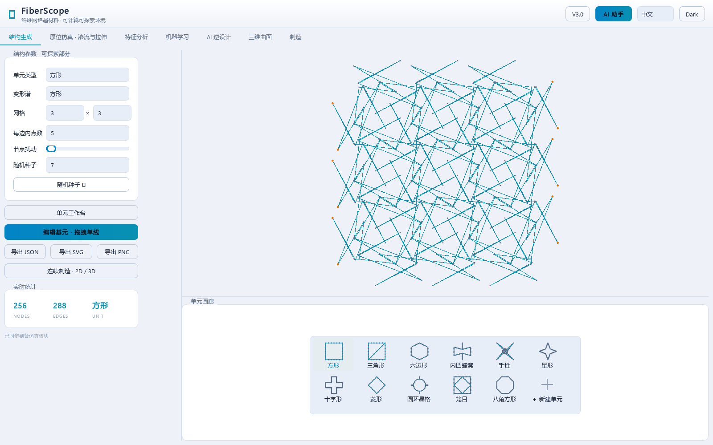 | 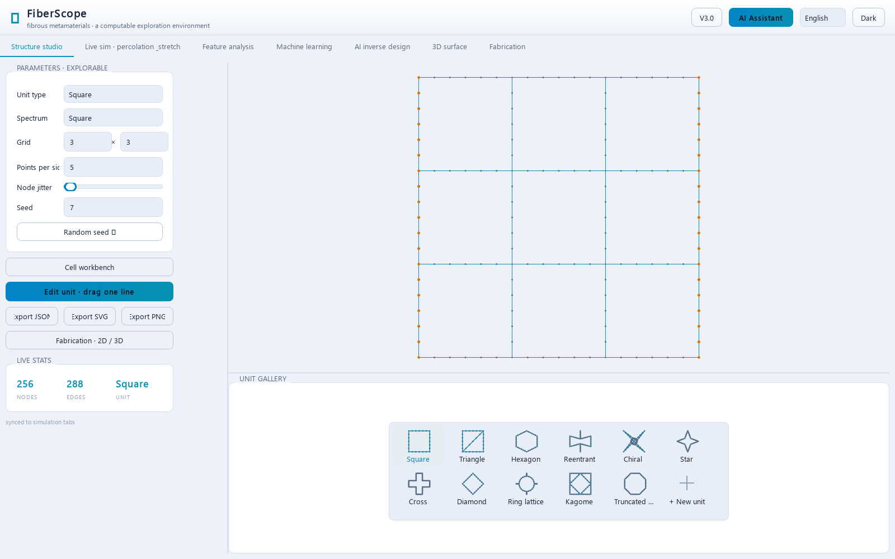 |

## 拉伸仿真 / Simulation

| 中文 | English |
| --- | --- |
| 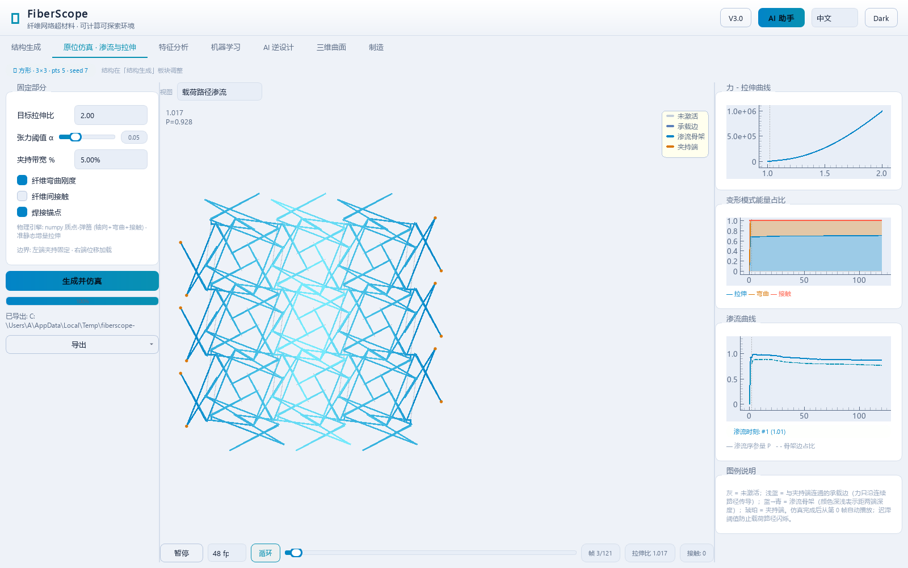 | 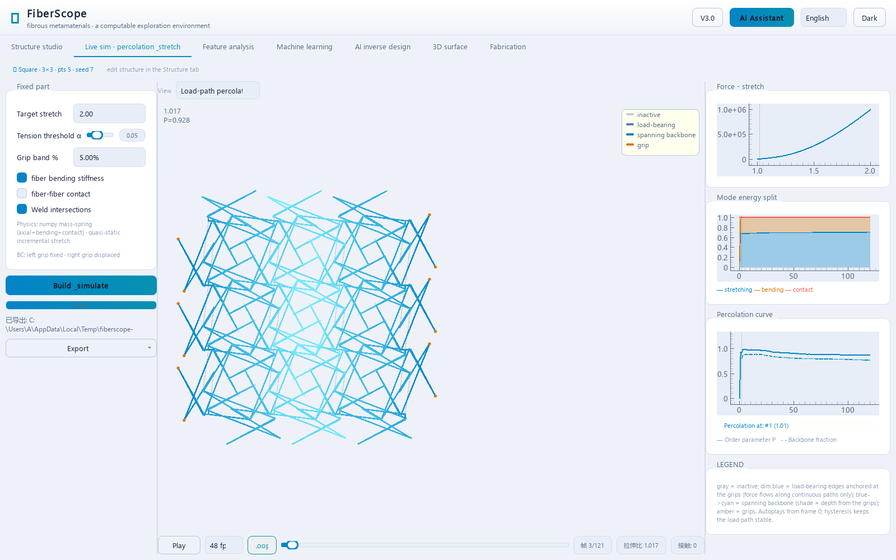 |

## 特征分析 / Features

| 中文 | English |
| --- | --- |
| 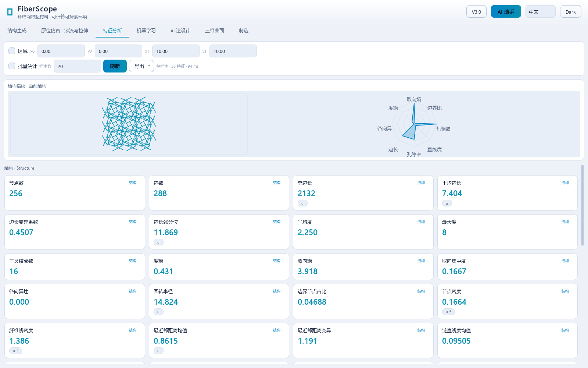 |  |

## 机器学习 / Machine learning

| 中文 | English |
| --- | --- |
| 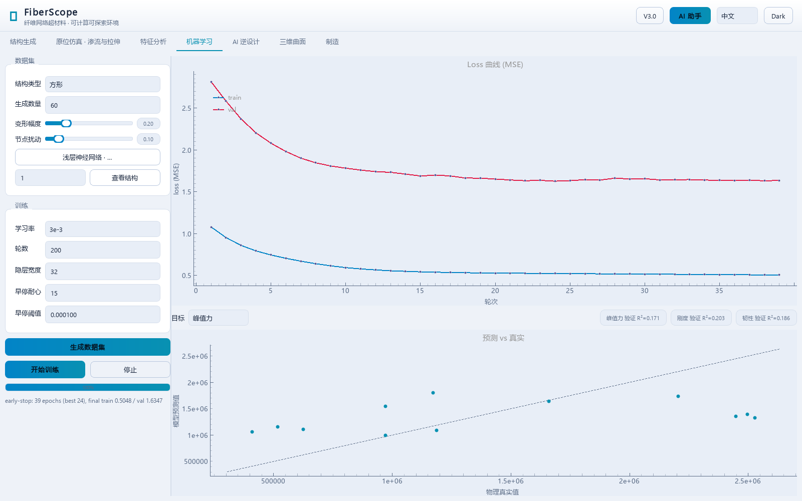 | 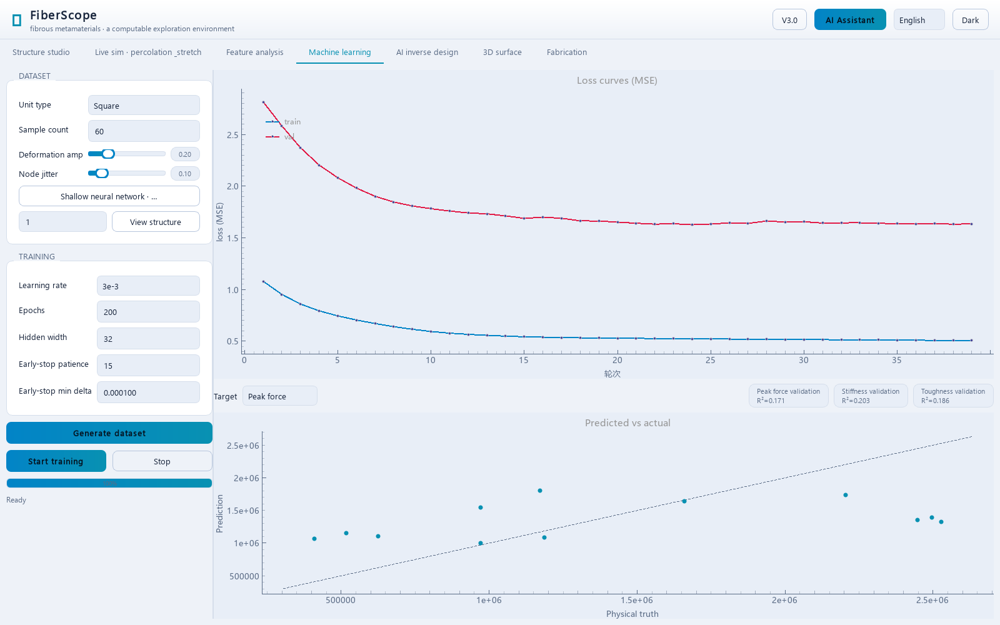 |

## AI 逆向设计 / Inverse design

| 中文 | English |
| --- | --- |
| 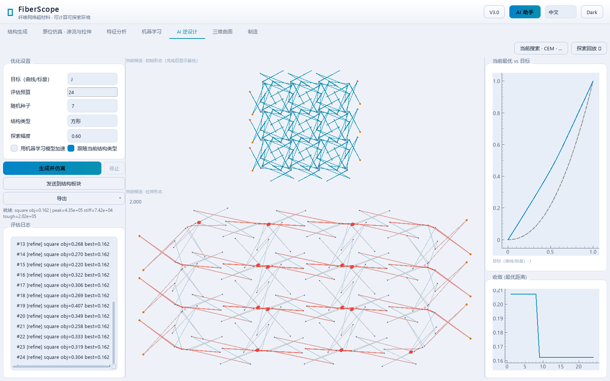 | 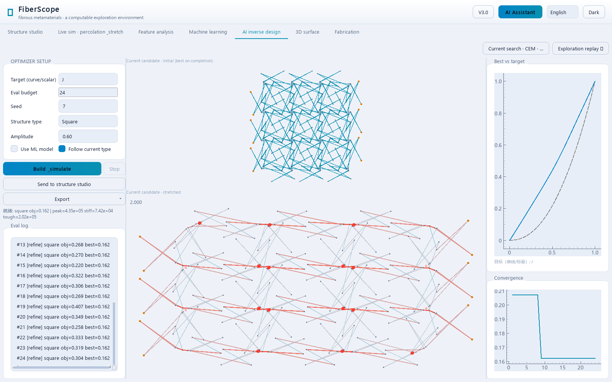 |

## 三维曲面 / Surface mapping

| 中文 | English |
| --- | --- |
| 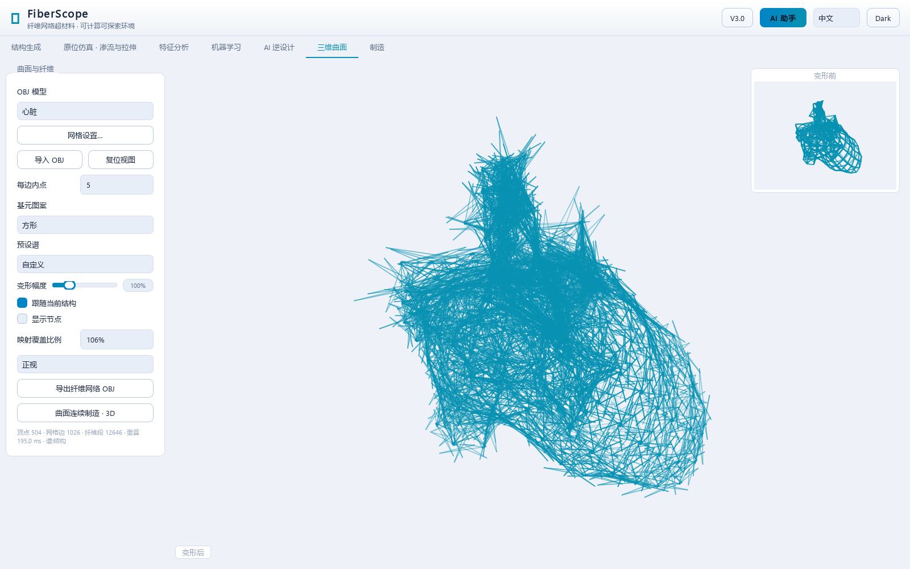 | 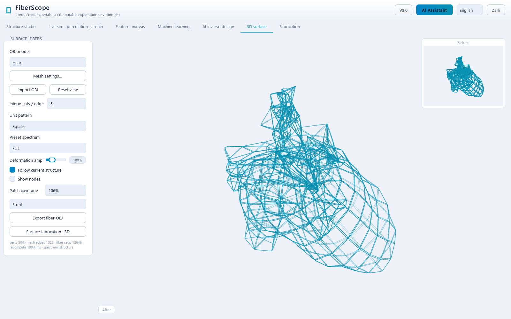 |

## 制造 / Manufacturing

| 中文 | English |
| --- | --- |
| 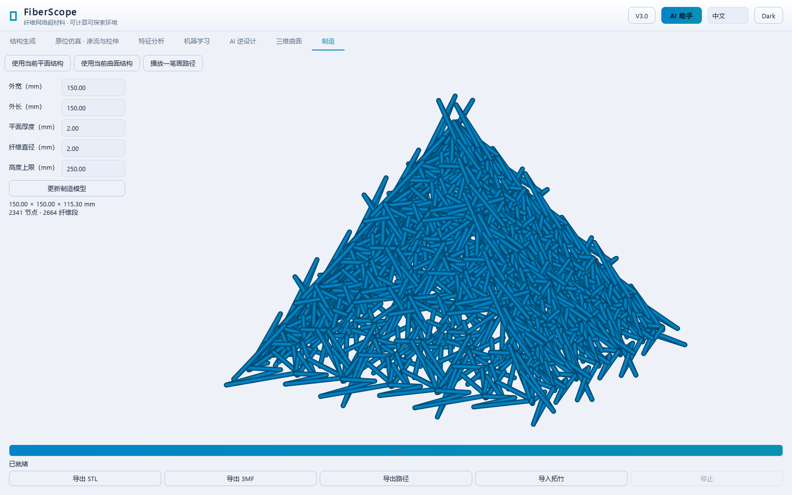 | 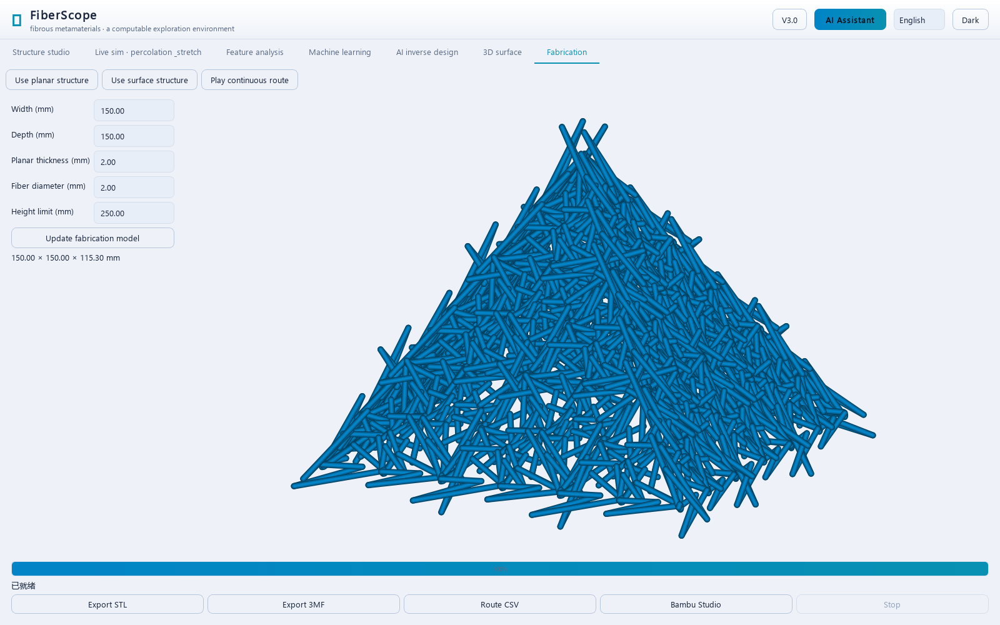 |

## AI 助手 / AI assistant

| 中文 | English |
| --- | --- |
| 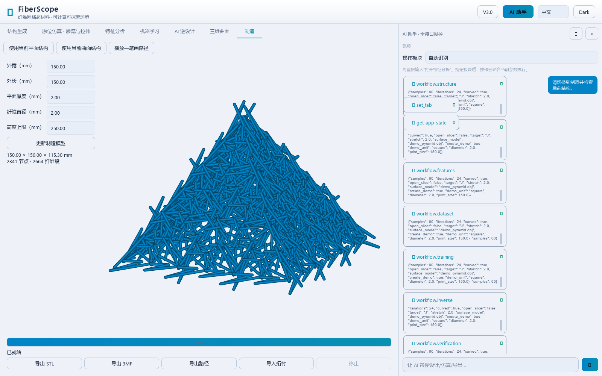 | 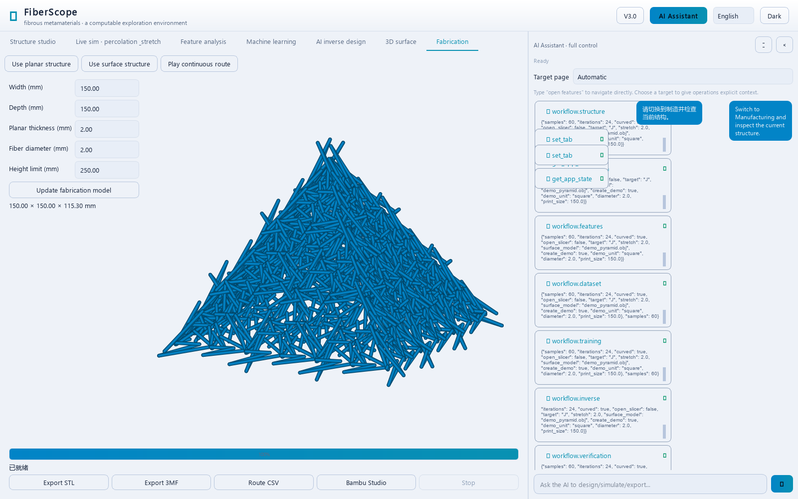 |
