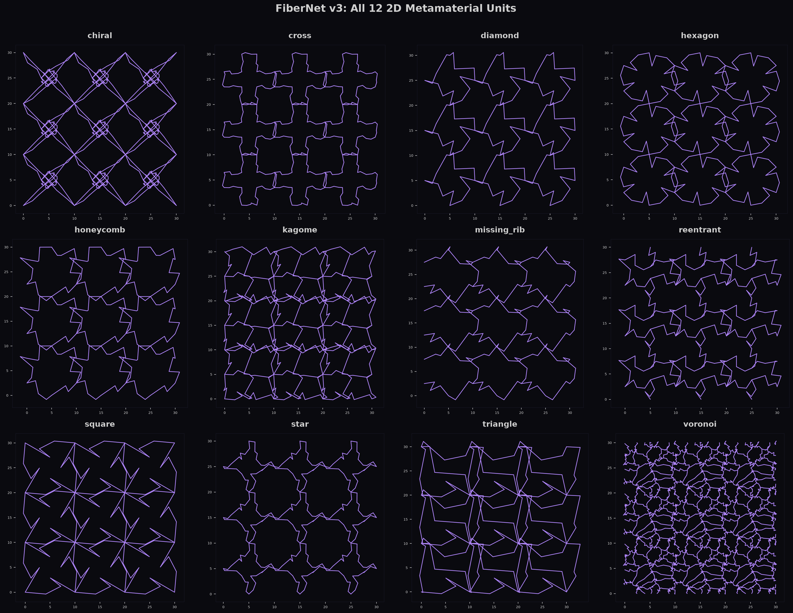
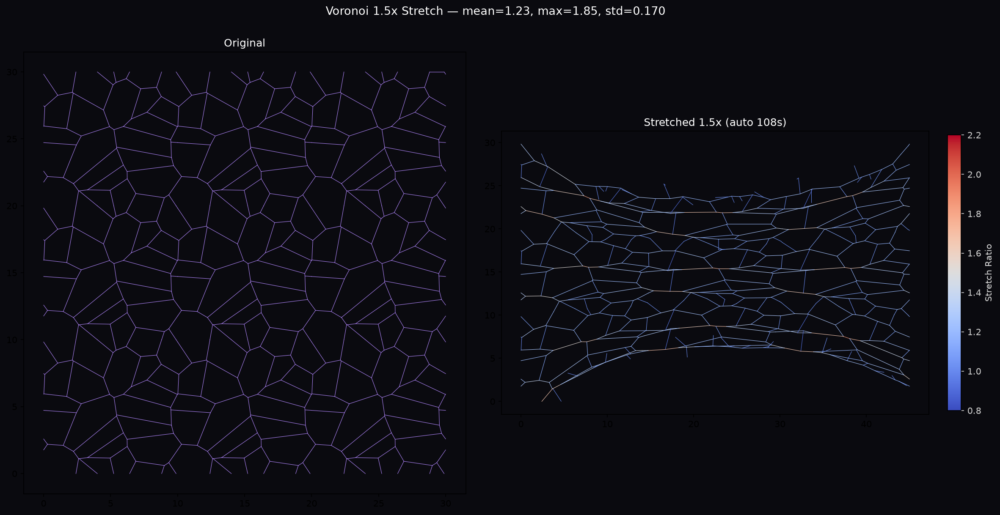

<div align="center">

# 🧬 FiberNet v4.0

### Python Toolkit for Fiber Network Design, Simulation & Intelligent Optimization
### 纤维网络结构生成、力学模拟与智能优化 Python 工具包

---

[](https://pypi.org/project/fibernet/4.0.3/)
[](https://www.python.org/)
[](LICENSE)
[](https://pypi.org/project/fibernet/)

**[Installation](#-installation--安装)** · **[Quick Start](#-quick-start--快速开始)** · **[API Reference](#-api-reference--api-参考)** · **[Tutorial](#-tutorial--教程)** · **[中文](#-中文说明)**

*Developed by [ML-BioMat Lab](https://ml-biomat.com/) @ [BMG-FDU](https://github.com/BMG-FDU)*

---

</div>

## 📖 Overview

FiberNet is a research-grade Python toolkit for **computational design of fiber network structures** — from periodic unit cells to complex metamaterials. It provides a complete closed-loop workflow:

```
Generation → Simulation → Feature Extraction → Machine Learning → Reinforcement Learning
```

**FiberNet 是一个面向材料科学的研究级 Python 工具包，用于纤维网络结构的计算设计。** 提供从结构生成到力学模拟再到智能优化的完整闭环工作流。

### ✨ Core Capabilities / 核心能力

| Feature | Description | 说明 |
|---------|-------------|------|
| **12 Unit Types** | square, triangle, hexagon, honeycomb, kagome, voronoi, chiral, reentrant, star, cross, diamond, missing_rib | 12种基元 |
| **Parametric Control** | Internal point displacements for RL-ready continuous action spaces | 参数化内部点位移控制 |
| **Taichi Simulation** | Mass-spring dynamics with auto-relaxation, trajectory recording | Taichi质点弹簧动力学 |
| **94-Dim Features** | Structural + pore + contact feature extraction | 94维特征提取 |
| **One-Line ML** | `predict_from_csv()` → train, evaluate, visualize, save | 一行ML训练 |
| **One-Line RL** | `run_bayesian_optimization()` → optimize structure parameters | 一行RL优化 |
| **Stress Visualization** | Multi-frame trajectory with edge stretch coloring | 多帧应力可视化 |

---


### 🖼️ Showcase / 展示

<div align="center">

</div>

*2D Structure Gallery: 12 unit types (square, triangle, hexagon, honeycomb, kagome, voronoi, chiral, reentrant, star, cross, diamond, missing_rib).*

<div align="center">

</div>

*Voronoi structure under 1.5× uniaxial stretch — showing deformation and stress distribution.*

*Left: 2D structure gallery (12 unit types). Right: Voronoi structure under 1.5× uniaxial stretch.*
*2D结构画廊：12种基元（正方形、三角形、六边形、蜂窝、kagome、Voronoi、手性、凹角、星形、十字、钻石、缺肋）。*

*Voronoi结构在1.5倍单轴拉伸下的变形 — 显示形变和应力分布。*

---


### 📐 Structure Catalog / 结构目录

FiberNet supports **12 built-in unit types** across **6 architecture families**:

| Family | Units | Description | 描述 |
|--------|-------|-------------|------|
| **Regular Lattices** | square, triangle, hexagon | Classic periodic tessellations | 经典周期镶嵌 |
| **Honeycomb Variants** | honeycomb, reentrant, missing_rib | Auxetic and cellular solid models | 凹角与胞状固体 |
| **Auxetic/Chiral** | chiral, star | Negative Poisson's ratio structures | 负泊松比结构 |
| **Cross/Diamond** | cross, diamond | Cross-braced and diamond patterns | 交叉与钻石图案 |
| **Kagome** | kagome | Tri-hexagonal lattice | 三六边形晶格 |
| **Disordered** | voronoi | Voronoi tessellation (random topology) | Voronoi镶嵌（随机拓扑） |

**Combinatorial space** (grid × pts_per_side × seed):
- Fixed parameters: **~91,800** unique structures
- With parametric displacement control: **7.98 × 10¹⁶** (discretized) to **∞** (continuous)
- With post-generation node manipulation: **368-dimensional** continuous action space (square 3×3, pts=5)

---

## 🚀 Installation / 安装

```bash
# Core installation / 核心安装
pip install fibernet

# Full installation (ML + RL + viz + simulation) / 完整安装
pip install fibernet[full]

# ML only / 仅ML
pip install fibernet[ml]

# RL only / 仅RL
pip install fibernet[rl]
```

### Optional Dependencies / 可选依赖

| Group | Packages | Install |
|-------|----------|---------|
| `ml` | scikit-learn, pandas, tqdm | `pip install fibernet[ml]` |
| `rl` | gymnasium, scikit-optimize, stable-baselines3 | `pip install fibernet[rl]` |
| `accel` | taichi (GPU acceleration) | `pip install fibernet[accel]` |
| `viz` | pyvista (3D visualization) | `pip install fibernet[viz]` |
| `full` | All of the above | `pip install fibernet[full]` |

---

## ⚡ Quick Start / 快速开始

### One-Line API / 一行代码

```python
import fibernet as fn

# Generate structure / 生成结构
g = fn.pattern_2d(unit="honeycomb", box=(10, 10), grid=(4, 4))

# Visualize / 可视化
fn.show(g)  # One line! / 一行出图

# Simulate / 模拟
r = fn.simulate(g, mode="stretch", strain=1.5, backend="spring")  # One line! / 一行模拟
print(f"max_force={r.max_force:.0f}, max_stretch={r.max_stretch:.3f}")

# ML prediction / ML预测
result = fn.predict_from_csv("data.csv", target="max_force", output_dir="ml_out/")  # One line! / 一行ML

# RL optimization / RL优化
best = fn.run_bayesian_optimization(objective_fn, param_space, n_iter=50)  # One line! / 一行RL
```

### Complete Pipeline / 完整流水线

```python
import fibernet as fn
from fibernet.ml import train_predictor, plot_predictions
from fibernet.rl import plot_reward_curve, run_bayesian_optimization
import numpy as np

# ─── 1. Generate Parametric Structures ───
# Each structure has 20 displacement parameters (4 sides × 5 points)
displacements = [(np.random.uniform(-0.3, 0.3), np.random.uniform(-0.3, 0.3))
                 for _ in range(20)]
g = fn.pattern_2d(
    unit="square", box=(10, 10), grid=(3, 3),
    n_pts_per_side=5,                    # 5 internal points per edge
    point_displacements=displacements,   # parametric control
)

# ─── 2. Simulate ───
engine = fn.TaichiEngine()
r = engine.stretch_test(
    g,
    target_stretch=1.5,      # stretch to 1.5× length
    stiffness=1e5,            # spring stiffness
    damping=0.3,              # damping ratio
    num_steps=1000,           # simulation steps
    save_interval=200,        # save trajectory every 200 steps
)
print(f"max_force={r.max_force:.0f}, max_stretch={r.max_stretch:.3f}")

# ─── 3. Visualize Deformation with Stress ───
fig = fn.render_trajectory(
    g, r.positions_trajectory, r.edge_stretches,
    n_frames=6, title="Stretch Process",
)
fig.savefig("deformation.png", dpi=150)

# ─── 4. Extract Features ───
ext = fn.GraphFeatureExtractor()
features = ext.extract(g)  # 94-dimensional feature vector

# ─── 5. Node Manipulation (for RL) ───
internal_nodes = g.get_internal_nodes()  # nodes available for RL actions
g.displace_node(internal_nodes[0], [0.1, 0.2])  # move node by (dx, dy)
```

---


### 🎯 RL Parametric Control / RL 参数化控制

FiberNet exposes **direct (dx, dy) displacement parameters** for each internal point on every edge, enabling continuous action spaces for reinforcement learning — equivalent to the `move_AB(G, num, dx, dy)` approach in research code, but more general.

```python
# Method 1: Displacement at generation time
# Agent outputs 20-dim continuous action vector
action = agent.act(observation)  # shape: (20,) values in [-0.3, 0.3]
displacements = [(action[2*i], action[2*i+1]) for i in range(10)]
g = fn.pattern_2d("square", grid=(3,3), n_pts_per_side=5,
                  point_displacements=displacements)

# Method 2: Post-generation refinement
internal_nodes = g.get_internal_nodes()  # 184 nodes for square 3×3 pts=5
for node_id in internal_nodes:
    g.displace_node(node_id, agent.refinement_action(node_id))
```

FiberNet 为每条边上的每个内部点暴露了 **(dx, dy) 位移参数**，为强化学习提供连续动作空间。
支持生成时位移控制和生成后逐节点微调两种方式。

---

## 📚 API Reference / API 参考

### Structure Generation / 结构生成

```python
# Generate 2D structure / 生成2D结构
g = fn.pattern_2d(
    unit="square",           # unit type / 基元类型
    box=(10, 10),            # cell size / 单元格尺寸
    grid=(3, 3),             # tiling grid / 铺排网格
    n_pts_per_side=5,        # internal points per edge / 每边内部点数
    point_displacements=disps,  # [(dx,dy), ...] displacements / 位移向量
    seed=42,                 # random seed / 随机种子
)

# Available units / 可用基元
print(fn.list_units())
# ['chiral', 'cross', 'diamond', 'hexagon', 'honeycomb', 'kagome',
#  'missing_rib', 'reentrant', 'square', 'star', 'triangle', 'voronoi']
```

### Node Manipulation / 节点操控 (for RL)

```python
# Displace a node / 移动节点
g.displace_node(node_id, [dx, dy])

# Set absolute position / 设置绝对位置
g.set_node_position(node_id, [x, y])

# Batch set / 批量设置
g.set_node_positions({1: [2.5, 0.5], 3: [7.5, 1.0]})

# Get internal (non-boundary) nodes → RL action targets
internal = g.get_internal_nodes()

# Get boundary nodes
boundary = g.get_boundary_nodes()
```

### Simulation / 模拟

```python
engine = fn.TaichiEngine()

# Uniaxial stretch test / 单轴拉伸
r = engine.stretch_test(
    graph,
    target_stretch=1.5,      # stretch ratio / 拉伸倍数
    stiffness=1e5,            # spring constant / 弹簧刚度
    damping=0.3,              # damping ratio / 阻尼比
    num_steps=1000,           # total steps / 总步数
    save_interval=200,        # trajectory save interval / 轨迹保存间隔
    auto_steps=True,          # auto-calculate steps from graph diameter / 自动计算步数
)

# Result fields / 结果字段
r.max_force          # maximum edge force / 最大边力
r.max_stretch        # maximum edge stretch ratio / 最大边拉伸比
r.mean_stretch       # mean stretch / 平均拉伸
r.edge_forces        # per-edge forces (N,) / 每边力
r.edge_stretches     # per-edge stretch ratios (N,) / 每边拉伸比
r.positions_trajectory  # list of (N,3) arrays / 位置轨迹列表

# Save/Load / 保存/加载
r.save("result.json", detailed=True)   # with trajectory / 含轨迹
r2 = fn.SimResult.load("result.json")  # restore / 恢复
```

### Visualization / 可视化

```python
# Render structure / 渲染结构
fig = fn.render_graph(g, theme="dark")       # dark purple / 暗紫
fig = fn.render_graph(g, theme="light")      # white background / 白底
fig = fn.render_graph(g, theme="blueprint")  # blueprint style / 蓝图风格

# Deformation comparison / 形变对比
fig = fn.render_deformation(g_original, g_deformed, color_by="stress")

# Multi-frame trajectory with stress / 多帧轨迹+应力
fig = fn.render_trajectory(
    g, r.positions_trajectory, r.edge_stretches,
    n_frames=6, title="Stretch Process",
)

# Themes / 主题
print(list(fn.THEMES.keys()))  # ['dark', 'light', 'blueprint', 'publication']
```

### Machine Learning / 机器学习

```python
from fibernet.ml import (
    train_predictor,         # Train model → (model, metrics)
    cross_validate,          # K-fold cross-validation
    compare_models,          # Compare multiple models
    predict_from_csv,        # One-line: CSV → train → save
    plot_predictions,        # Scatter: predicted vs actual
    plot_feature_importance, # Bar chart: feature importance
    plot_residuals,          # Residual analysis
    plot_learning_curve,     # Learning curve
)

# One-line ML / 一行ML
result = predict_from_csv(
    "simulation_results.csv",
    target="max_force",
    model_type="rf",         # rf, ridge, gb, svm, mlp
    output_dir="ml_output/",
)

# Manual training / 手动训练
model, metrics = train_predictor(X_train, y_train, model_type="rf")
print(f"R² = {metrics['r2']:.3f}")

# Cross-validation / 交叉验证
cv = cross_validate(X, y, model_type="ridge", cv=5)
print(f"CV R² = {cv['mean_r2']:.3f} ± {cv['std_r2']:.3f}")
```

### Reinforcement Learning / 强化学习

```python
from fibernet.rl import (
    plot_reward_curve,           # Reward curve with moving average
    plot_convergence,            # Optimization convergence
    plot_action_distribution,    # Action histogram
    evaluate_agent,              # Multi-episode evaluation
    save_agent, load_agent,      # Serialization
    run_bayesian_optimization,   # One-line Bayesian opt
)

# Bayesian optimization / 贝叶斯优化
param_space = {
    "grid_x": (2, 5),       # integer range / 整数范围
    "grid_y": (2, 5),
    "stiffness": (1e4, 1e6),  # continuous range / 连续范围
}

result = run_bayesian_optimization(
    objective_fn,          # fn(params) → scalar to minimize
    param_space,
    n_iter=50,
)
print(f"Best: {result['best_params']}, value={result['best_value']:.0f}")

# RL reward visualization / RL奖励可视化
plot_reward_curve(rewards, window=20, save_path="reward.png")
plot_convergence(objective_values, minimize=True, save_path="convergence.png")
```

---

## 🎓 Tutorial / 教程

A complete end-to-end tutorial is available as a Jupyter notebook:

```
tutorials/v4_tutorial/fibernet_v4_tutorial.ipynb
```

This tutorial covers:
1. **Structure Generation** — base + parametric variants with naming convention
2. **Batch Simulation** — stretch tests with trajectory recording + checkpoint resume
3. **Deformation Visualization** — multi-frame stress distribution
4. **Feature Extraction** — 94-dimensional structural features
5. **Machine Learning** — train/test split, nested CV (no data leakage), model comparison
6. **Reinforcement Learning** — Bayesian optimization of displacement parameters

To run the tutorial with a small test dataset first:

```bash
python3 tutorials/v4_tutorial/test_pipeline.py          # 5 samples (test)
python3 tutorials/v4_tutorial/test_pipeline.py --full    # 2000 samples (full)
```

**完整教程覆盖**: 结构生成 → 批量模拟 → 形变可视化 → 特征提取 → 机器学习 → 强化学习。先用5个样本测试，再扩展到2000个。

---

## 📁 Project Structure / 项目结构

```
fibernet/
├── fibernet/
│   ├── core/              # StructureGraph, Material, transforms
│   ├── gen/               # pattern_2d/3d, unit factories
│   ├── sim/               # TaichiEngine (mass-spring), SimResult
│   ├── viz/               # render_graph, render_trajectory, themes
│   ├── analysis/          # GraphFeatureExtractor (94-dim)
│   ├── ml/                # train_predictor, cross_validate, plots
│   ├── rl/                # Bayesian opt, reward curves, agent eval
│   └── easy.py            # show(), simulate(), batch_simulate()
├── tutorials/
│   └── v4_tutorial/       # Jupyter notebook + test pipeline
├── tests/                 # Unit tests
└── pyproject.toml         # Build configuration
```

---

## 🔬 How It Works / 工作原理

### Mass-Spring Model (Taichi)

FiberNet uses a **mass-spring dynamics model** implemented in Taichi for GPU-accelerated simulation:

1. **Nodes** are treated as point masses with position and velocity
2. **Edges** are linear springs with configurable stiffness and rest length
3. **Boundary nodes** are fixed (Dirichlet BC) during stretch tests
4. **Relaxation**: initial energy minimization before loading
5. **Loading**: controlled displacement of boundary nodes to target stretch ratio

```
F_spring = k × (current_length - rest_length)
F_damping = -c × velocity
F_drag = -γ × velocity  (dashpot)
```

### Parametric Structure Control (for RL)

Each unit cell edge can have `n_pts_per_side` internal nodes, each with a programmable `(dx, dy)` displacement. This creates a continuous action space for reinforcement learning:

```
Action = [dx₁, dy₁, dx₂, dy₂, ..., dxₙ, dyₙ] ∈ [-0.3, 0.3]^(2n)
```

For a square unit with `n_pts_per_side=5`, this gives **20 continuous parameters** — enough for complex beam geometries.

---

## 📊 Performance / 性能

| Task | Time (per structure) | Hardware |
|------|---------------------|----------|
| Generation (square 3×3, 5 pts/side) | ~0.1s | CPU |
| Stretch simulation (1000 steps) | ~2.5s | CPU (Taichi x64) |
| Feature extraction (94-dim) | ~0.5s | CPU |
| ML training (RF, 100 samples) | ~1s | CPU |
| Bayesian opt (30 iterations) | ~90s | CPU |

---

## 📝 Citation / 引用

If you use FiberNet in your research, please cite:

```bibtex
@software{fibernet2024,
  title = {FiberNet: Python Toolkit for Fiber Network Design and Optimization},
  author = {ML-BioMat Lab, BMG-FDU},
  year = {2026},
  url = {https://github.com/GellmanSparrowS/fibernet},
  version = {4.0.0},
}
```

---

## 📄 License

MIT License. See [LICENSE](LICENSE) for details.

---

## 🇨🇳 中文说明

### 概述

FiberNet 是一个面向材料科学的 Python 工具包，提供纤维网络结构的完整工作流：

- **12种基元生成**: 正方形、三角形、六边形、蜂窝、kagome、Voronoi 等
- **参数化控制**: 每个边上的内部点可以独立位移，支持RL连续动作空间
- **Taichi模拟**: 质点弹簧动力学，自动弛豫，轨迹记录
- **94维特征**: 结构+孔隙+接触特征提取
- **一行ML**: `predict_from_csv()` 自动训练、评估、可视化、保存
- **一行RL**: `run_bayesian_optimization()` 优化结构参数

### 安装

```bash
pip install fibernet        # 核心
pip install fibernet[full]  # 完整 (ML + RL + 可视化 + 模拟)
```

### 快速开始

```python
import fibernet as fn

# 生成
g = fn.pattern_2d(unit="honeycomb", box=(10,10), grid=(4,4))

# 可视化（一行）
fn.show(g)

# 模拟（一行）
r = fn.simulate(g, mode="stretch", strain=1.5, backend="spring")

# ML（一行）
result = fn.predict_from_csv("data.csv", target="max_force")

# RL（一行）
best = fn.run_bayesian_optimization(objective_fn, param_space, n_iter=50)
```

### 节点操控（RL动作空间）

```python
# 移动节点
g.displace_node(node_id, [dx, dy])

# 获取可优化节点
internal = g.get_internal_nodes()

# 批量设置
g.set_node_positions({1: [2.5, 0.5], 3: [7.5, 1.0]})
```

### 教程

完整教程：`tutorials/v4_tutorial/fibernet_v4_tutorial.ipynb`

测试运行（5个样本）：
```bash
python3 tutorials/v4_tutorial/test_pipeline.py
```

全量运行（2000个样本）：
```bash
python3 tutorials/v4_tutorial/test_pipeline.py --full
```

---

*FiberNet v4.0.0 | [PyPI](https://pypi.org/project/fibernet/4.0.3/) | [GitHub](https://github.com/GellmanSparrowS/fibernet)*
