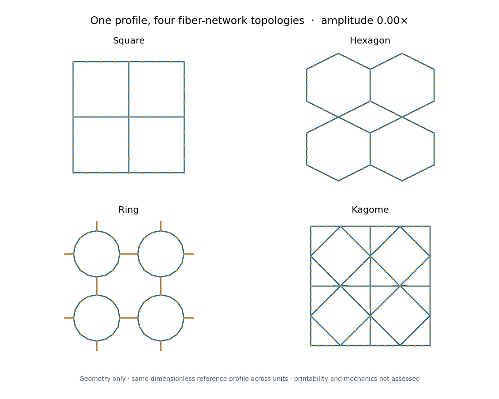
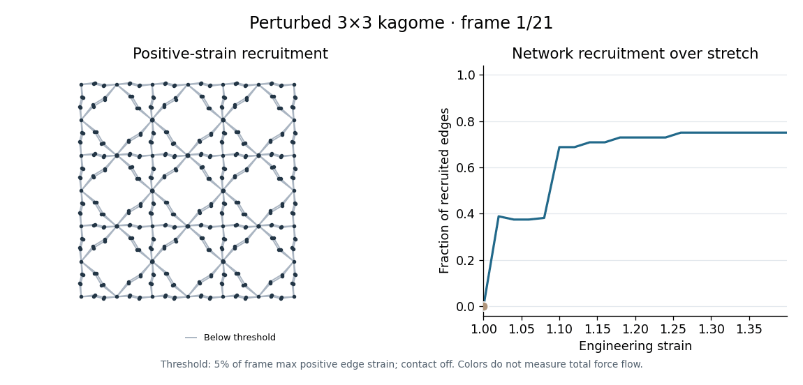
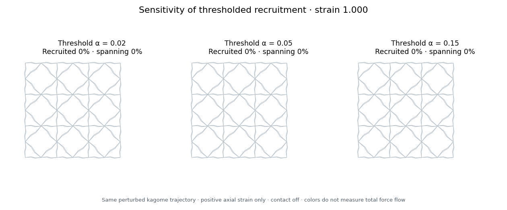
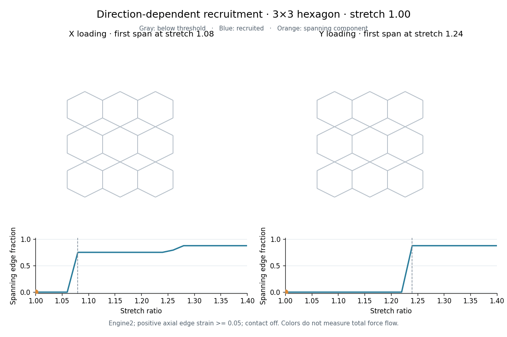
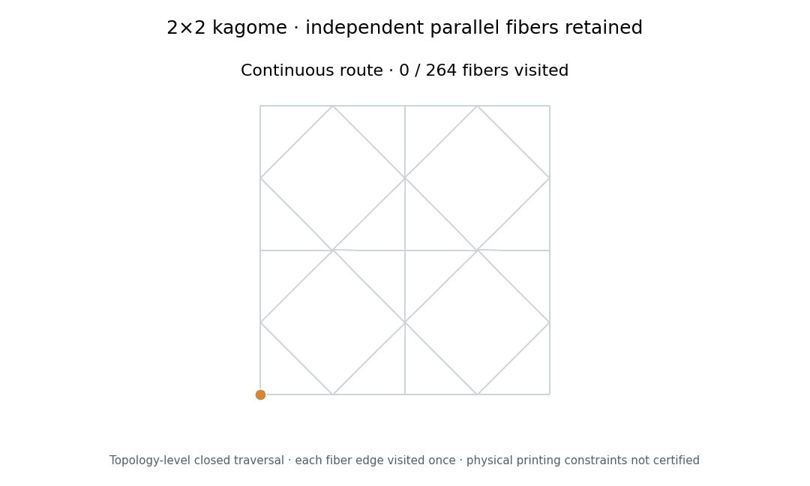
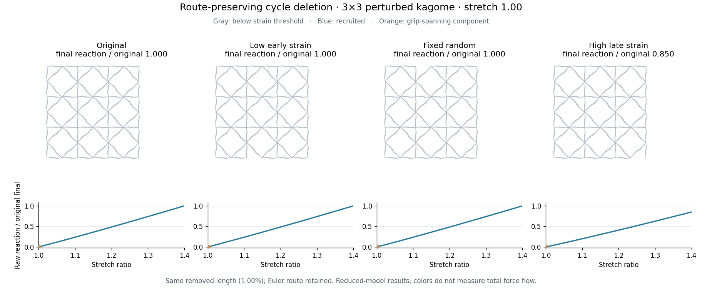
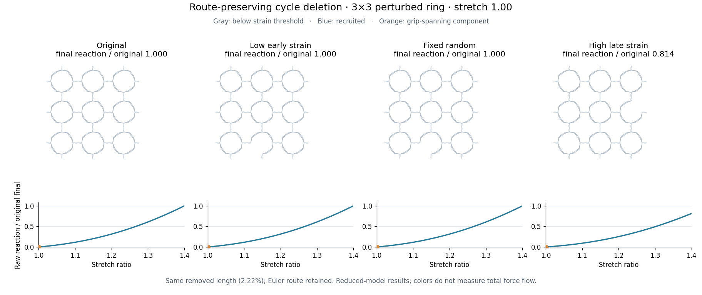

# FiberNet + FiberScope

**An open workflow for constructing, simulating, and studying fiber networks in Python and a desktop interface.**

FiberNet supplies programmable graph, generation, analysis, and modeling tools. FiberScope is the interactive application built around fiber-network design workflows. The two are being unified so a scientific calculation can be configured, inspected, and reproduced across Python and the APP. This page documents the **4.2.0 development branch**; a new PyPI or desktop release has not yet been published.

[Start here](#start-here) · [Generation](#shape-one-profile-across-four-topologies) · [Stretch and recruitment](#see-the-network-respond) · [Python quick start](#python-quick-start) · [Route-preserving study](#reproduce-and-extend) · [Desktop application](#desktop-application) · [Methods](docs/METHODS_TENSILE_RECRUITMENT.md) · [Current coverage](docs/CAPABILITY_AUDIT_2026-09-24.md)

## Start here

This preview belongs to the **existing `fibernet` repository and Python package**. Development uses a local branch of that repository; [repository and release status](docs/INTEGRATION_REPO_MAP.md) explains the layout. The current homepage is source-backed and distinguishes tested code from published releases.

With Python 3.10, from the repository root, install the checkout with `python -m pip install -e .`. The [complete runnable workflow](examples/open_source_workflow.py) uses the library's beam-frame FEM and does not require the desktop APP. The animated 3×3 kagome stretch below uses the now shared reduced spring/bending/contact solver, also available without the APP through the [trajectory example](examples/reduced_recruitment_workflow.py). These are different models with different assumptions.

| If you want to... | Start with | What you get |
| --- | --- | --- |
| Generate or inspect a 2D network | `pattern_2d`, `show` | A graph with nodes, edges, radii, and an optional figure |
| Stretch a small network in Python | `simulate(..., backend="fem")` | Displacement, stress-related metadata, and a serializable result |
| Replay the APP's reduced stretch model in Python | `ReducedBeamSolver`, `ReducedBeamConfig` | Node frames, edge strain, raw reaction, bending/contact energy |
| Analyze thresholded edge recruitment | `analyze_tensile_recruitment` | Per-frame active edges, grip-spanning components, and threshold curves |
| Measure a planar network snapshot | `SnapshotFeatureExtractor` | Structural, bounded-pore, distribution and optional finite-width contact descriptors |
| Study many generated networks | `batch_simulate` | A CSV with measured force, displacement, and energy summaries |
| Build a closed planar or curved route | `PlanarManufacturingConfig`, `compile_planar`, `compile_surface` | Reference/actual coordinates, parallel edges, and a closed Euler route |
| Save a custom unit shared with the desktop editor | `CustomCell`, `CustomCellRegistry` | APP-compatible JSON, a reusable graph, and a compilable route |
| Create geometry files for inspection | `build_solid`, `export_solid`, `export_route` | Closed mesh, STL/3MF, and edge-ordered CSV with optional dependencies |
| Use the visual manufacturing workspace | FiberScope desktop | Interactive configuration, path playback, and export tools |

The [coverage audit](docs/CAPABILITY_AUDIT_2026-09-24.md) states which advanced APP capabilities still need a public library API. A locally built wheel has been installed into an isolated Python 3.10 target, where generation, reduced solver, and regressor calls passed. Solver forces need calibration against experiment before quantitative material claims.

## Shape one profile across four topologies



The square, hexagon, ring, and kagome panels use the same dimensionless reference-fiber displacement profile in the APP's current manufacturing-topology builder. The animation changes geometry while retaining each panel's graph connectivity. It is a **geometry demonstration**, not a printability or mechanical-performance result. The [editable peak-frame SVG](docs/media/spectrum_four_topologies_peak.svg) and [source/parameter manifest](docs/media/spectrum_four_topologies.json) accompany the GIF. Regenerate the spectrum and related animations with `python scripts/make_homepage_media.py` from the repository root. The profile and planar manufacturing builder are now shared through the [Python library](docs/METHODS_MANUFACTURING_UNIFIED.md).

## See the network respond



The perturbed 3×3 kagome network has 436 nodes and 576 edges and is stretched in the FiberScope reduced model. Blue edges exceed a positive-strain threshold; orange edges belong to a recruited component spanning both grips. The trace reports the fraction of recruited edges. These colors summarize a strain-threshold graph; they do **not** measure complete mechanical force flow. The animation and [editable final-frame SVG](docs/media/tensile_recruitment_kagome_final.svg) have fixed parameters and a saved [provenance/source-hash manifest](docs/media/tensile_recruitment_kagome.json).

### Change the analysis threshold, keep the trajectory fixed



The three panels analyze the **same node trajectories** at α = 0.02, 0.05, and 0.15. Only the edge-strain threshold changes. The display makes parameter sensitivity visible before interpreting a connected path. Download the [editable comparison SVG](docs/media/tensile_threshold_sensitivity_final.svg) or inspect the [parameter and source manifest](docs/media/tensile_threshold_sensitivity.json). Neither the colors nor the thresholded connection prove local force transfer.

### Compare loading directions on the same topology



The same 3×3 hexagon topology is stretched horizontally and vertically. With a positive axial edge-strain minimum of 0.05, the reduced solver first finds a grip-spanning recruited component at stretch ratios 1.08 and 1.24, respectively. Gray edges remain below the threshold, blue edges are recruited, and orange edges belong to a spanning component. The [editable vector keyframe](docs/media/directional_recruitment_hexagon_final.svg) and [source/parameter manifest](docs/media/directional_recruitment_hexagon.json) make this local example inspectable. This is a directional **threshold statistic**, not a full force-flow image; an [independent nonlinear beam-FEM screen](docs/RECRUITMENT_SENSITIVITY_2026-09-24.md) preserves the directional contrast at stretch 1.24 but does not reproduce the reduced solver's exact onset.

## One model, two ways to work

| Task | Python library | FiberScope desktop |
| --- | --- | --- |
| Basic 2D/3D patterns and graph operations | Available | Available |
| Thresholded tensile-strain recruitment | Public analysis API in this development branch | Same shared calculation, visual playback |
| Reduced stretch/bending/contact solver | Public trajectory API and saved-array example | Same numeric core with interactive controls |
| Continuous planar/curved route, OBJ input and solid export | Public geometry APIs in this development branch | Same shared geometry core plus interactive controls |
| Custom cell definitions and persistence | Shared bounded JSON registry and route compilation | Same registry core with visual editing |
| Physical labels, three-target surrogate and active sampling | Shared resumable label stream, six-model workflow and public 14-feature API | Same stream, model and acquisition core with data-generation UI |
| Target-curve inverse design | Shared curve/scalar objective search with a caller-supplied graph builder | Same search with interactive design controls |
| FEM and general ML tools | Available, with solver-specific assumptions | Selected workflows available |
| Structural, pore and finite-width contact snapshot cards | Shared bounded NumPy extractor; separate from the older 94-feature ML schema | Same calculation with interactive cards and region selection |

The [capability audit](docs/CAPABILITY_AUDIT_2026-09-24.md) lists the exact gaps and release gates. A user should not assume that every APP tool is already callable from the installable library. Solver outputs require calibration before quantitative experimental prediction.

## Python quick start

```python
import numpy as np
from fibernet.analysis import analyze_tensile_recruitment

edges = np.array([[0, 1], [1, 2], [0, 2]])
edge_strain = np.array([[0.0, 0.0, 0.0], [0.2, 0.3, -0.1]])
result = analyze_tensile_recruitment(
    edge_strain, edges, left_nodes=[0], right_nodes=[2], n_nodes=3
)
print(result.perc_frame)  # 1
```

From a source checkout, run `python -m examples.tensile_recruitment_quickstart` for a complete executable example. The [method definition](docs/METHODS_TENSILE_RECRUITMENT.md) documents thresholds, hysteresis, output fractions, and physical limits. The Python 3.10 test suite and an isolated installation of a locally built wheel have passed. Source tests also passed on Linux, macOS, and Windows with Python 3.9–3.12. Third-party-machine installation, frozen APP portability outside Windows, and broader optional-dependency combinations still need verification.

To replay the desktop APP's reduced model directly in Python, run `python -m examples.reduced_recruitment_workflow --output-dir demo_stretch`. The [trajectory workflow](examples/reduced_recruitment_workflow.py) saves node frames, ordered edges, edge axial strain, raw reaction, recruited masks, and a JSON summary. The solver includes axial springs, a degree-two bending approximation, and optional node contact; its [method description](docs/METHODS_REDUCED_SOLVER_UNIFIED.md) distinguishes it from the beam-frame FEM below. Neither solver is calibrated to a material experiment here.

### Generate, simulate, save, and analyze

Run `python -m examples.open_source_workflow --output-dir demo_output` from a source checkout. This [executable Python 3.10 example](examples/open_source_workflow.py) creates a honeycomb graph, saves a network figure, runs a small-strain beam-frame FEM stretch, saves and reloads the simulation JSON, then calculates axial edge strain and thresholded grip-to-grip recruitment. The output directory contains `network.png`, `fem_result.json`, and `summary.json`. The small-strain FEM example is a software workflow check; its force is not calibrated to an experiment.

For direct use in a notebook:

```python
import fibernet as fn

graph = fn.pattern_2d(unit="honeycomb", box=(10, 10), grid=(2, 2),
                      radius=0.05, seed=23)
result = fn.simulate(graph, backend="fem", mode="stretch", strain=1.01)
print(graph.num_nodes, graph.num_edges, result.max_displacement)
```

The [full example](examples/open_source_workflow.py) shows edge ordering, grip selection, and result serialization explicitly. For several structures, `fn.batch_simulate(configs, "results.csv", strain=1.01)` writes `max_force`, `max_displacement`, and `energy` columns. In the beam-FEM backend, `max_force` is the **largest individual beam axial force**, computed with that beam's actual radius; it is not a grip reaction or an effective Young's modulus. `energy` is an axial-stress proxy rather than total bending-plus-contact energy. The public stretch shortcut retains independent parallel fibers; the [beam-FEM API and units](docs/METHODS_BEAM_FEM_CONTRACT.md) and [corrected independent-model scope](docs/RECRUITMENT_SENSITIVITY_2026-09-24.md) explain why those distinctions matter.

### Measure a network snapshot

For the APP's structural, planar-pore and finite-width contact descriptors, run `python -m examples.snapshot_features_workflow --output-dir demo_features --contact`. The [pure-library example](examples/snapshot_features_workflow.py) writes scalar JSON and distribution NPZ; `from fibernet.analysis import SnapshotFeatureExtractor, ContactConfig` exposes the same calculation used by the APP's feature cards. Coordinates and contact width share a length unit, while pore/contact areas use its square. The [feature definitions and budgets](docs/METHODS_SNAPSHOT_FEATURES_UNIFIED.md) distinguish this snapshot schema from the library's older 94-feature ML extractor. Pixel overlap is a geometric descriptor, not contact force.

### Train the shared physical surrogate

Install the optional ML dependencies with `python -m pip install -e ".[ml]"`, then run `python -m examples.physical_learning_workflow --output-dir demo_learning`. The [runnable workflow](examples/physical_learning_workflow.py) defaults to clearly labeled synthetic data for checking the API; pass `--data samples.npz` with `X` shaped `(N, 14)` and physical `Y` shaped `(N, 3)` for your own peak, stiffness, and work labels. It writes held-out predictions and a metric summary. In Python, `from fibernet.ml import light_features, PhysicalRegressor` gives the same descriptor and six-model adapter used by FiberScope; the [method and leakage controls](docs/METHODS_PHYSICAL_LEARNING_UNIFIED.md) describe training-only normalization and the limits of a random holdout split. The synthetic demo is not evidence of material prediction accuracy.

### Generate resumable physical labels

To create the physical-label dataset used for a later regressor, run `python -m examples.physical_dataset_workflow --output-dir demo_labels --samples 8`. The [resumable library-only example](examples/physical_dataset_workflow.py) saves 14 geometry features and three reduced-solver labels after each case; repeating the command resumes the checkpoint. `from fibernet.ml import PlanarPhysicalDataset` exposes the same stream core as the APP. Its [sampling, target and provenance definition](docs/METHODS_PHYSICAL_DATASET_UNIFIED.md) explains why these values are numerical labels rather than measurements.

### Search a target stretch curve

Run `python -m examples.curve_inverse_workflow --output-dir demo_inverse --budget 8` to search a J-shaped normalized force curve with the same reduced-solver inverse core used by the desktop application. The [library-only example](examples/curve_inverse_workflow.py) limits graph and evaluation budgets and saves the best numerical objective and design controls. `from fibernet.ml import CurveInverseDesigner` exposes the search to notebooks; supply a graph builder and either a fixed unit or explicit candidate units. The [method and objective definitions](docs/METHODS_CURVE_INVERSE_UNIFIED.md) distinguish normalized curve shape and raw scalar reaction objectives. Optimization results are numerical model outcomes, not material validation.

### Generate a continuous planar and curved route

To save a unit drawn in FiberScope and use it from Python, run `python -m examples.custom_cell_workflow --output-dir demo_custom_cell`. This [small independent example](examples/custom_cell_workflow.py) writes the APP-compatible `custom_units.json`, reloads it, and compiles a 2×2 connected closed route. In a notebook, use `from fibernet.gen import CustomCell, CustomCellRegistry`; call `CustomCell.from_mapping(spec)` to validate a JSON record and `cell.to_graph()` as `PlanarManufacturingConfig(base_graph=...)`. The [shared data format and bounds](docs/METHODS_CUSTOM_CELL_UNIFIED.md) explain the coordinate units and persistence rules. A closed graph route is not a physical printability certificate.


Run `python -m examples.manufacturing_workflow --output-dir demo_routes` from the source checkout. The [runnable example](examples/manufacturing_workflow.py) saves two numeric `.npz` files and a JSON summary. Each `.npz` includes `reference`, `positions`, `edges`, `route_nodes`, and `route_edges` in matching order. In a notebook:

```python
from fibernet.gen import PlanarManufacturingConfig, compile_planar

config = PlanarManufacturingConfig(unit="kagome", grid_x=2, grid_y=2,
                                   n_pts_per_side=2, seed=23)
network = compile_planar(config)
assert network.route_nodes[0] == network.route_nodes[-1]
assert len(network.route_edges) == len(network.edges)
```

The same config can be passed to `compile_surface(vertices, quad_faces, config)` for a four-corner surface mesh. The [method and limits](docs/METHODS_MANUFACTURING_UNIFIED.md) describe the graph construction and seam rules. A closed graph route alone does not certify physical printability.

To start from an OBJ file, use `from fibernet.gen import load_obj` and pass its vertices and quad faces to `compile_surface`. The [OBJ to route example](examples/obj_surface_workflow.py) does both steps and saves a numeric route plus input metadata. From the source checkout, run `python -m examples.obj_surface_workflow FiberScope/assets/obj/demo_pyramid.obj --output-dir demo_obj_route`. The loader enforces file and mesh budgets; optional face reduction requires `fast-simplification` from the `manufacturing` extra. OBJ coordinates retain their input units.

For repeated cells attached to each curved patch, use `MappingConfig` and `map_cells(vertices, quad_faces, spectrum, unit="hexagon")`. The [surface mapping example](examples/surface_mapping_workflow.py) saves the mapped points and seam-connected segments from an OBJ. Run `python -m examples.surface_mapping_workflow FiberScope/assets/obj/demo_pyramid.obj --output-dir demo_mapped_cells`. This produces a connected segment representation; use the continuous-route workflow above when an ordered closed route is required.



The orange point follows the library's closed Euler route through the same 2×2 kagome graph. Blue segments have already been visited; gray segments remain. Every independent fiber edge is counted once, including parallel fibers. The [editable final SVG](docs/media/continuous_route_kagome_final.svg) and [source and parameter manifest](docs/media/continuous_route_kagome.json) are provided. This is a graph traversal, not a printer motion or a bond-quality test.

### Export a bounded solid and route file

Install optional geometry dependencies with `python -m pip install -e ".[manufacturing]"`, then run `python -m examples.solid_export_workflow --output-dir demo_solid`. The [executable example](examples/solid_export_workflow.py) generates a small closed solid and writes binary STL, millimeter 3MF, an edge-ordered route CSV, and a JSON summary. It checks the triangle count, 3MF unit, and positive closed-mesh volume after export. The desktop APP uses the same geometry and export core; printer handoff and interactive controls remain APP functions. This example verifies file format and topology, not a printer-specific process window.

## Desktop application

The [current FiberScope 3.0 release](https://github.com/GellmanSparrowS/fibernet/releases/tag/fiberscope-v3.0.0) and [desktop guide](FiberScope/README.md) describe the published APP. This unified branch adds an English default interface and uses the library's shared recruitment calculation. A new executable has **not** been released from this branch. [English and Chinese interface screenshots](FiberScope/docs/screenshots/README.md) document existing workflows.

## Reproduce and extend



The 3×3 perturbed kagome example contains 436 nodes and 576 fibers before intervention. All four panels use the same original graph and loading; three deletion choices each remove the same 1.00% edge-length class and retain an Euler route. The low-early-strain and fixed-random choices retain approximately the original final reduced-model reaction, while the high-late-strain choice has a ratio of 0.850 in this **one case**. The larger network makes the local edge changes and evolving grip-spanning component visible within a representative simulation sized like the main stretch animation. Inspect the [editable final-frame SVG](docs/media/route_preserving_intervention_kagome_final.svg) and [source/parameter manifest](docs/media/route_preserving_intervention_kagome.json). Rebuild with `python scripts/make_intervention_media.py --case kagome:seed23:x` after completing the study checkpoint. This numerical contrast is model-specific: the [same-graph independent FEM comparison](docs/INDEPENDENT_FEM_CYCLE_INTERVENTION_2026-09-24.md) does not support a general safe-deletion claim.



The companion 3×3 perturbed ring uses a matched 2.22% removed edge length. Each remaining graph has a constructed Euler route; the high-late-strain deletion has a smaller final raw reaction in this **one numerical case**, while the low-early and fixed-random choices are nearly indistinguishable. The colored edges in both animations show thresholded positive axial strain, not full force flow. Inspect the [editable final-frame SVG](docs/media/route_preserving_intervention_ring_final.svg), [source and parameter manifest](docs/media/route_preserving_intervention_ring.json), and [full study report](docs/CONSTRAINED_CYCLE_INTERVENTION_2026-09-24.md). Rebuild this second animation with `python scripts/make_intervention_media.py --case ring:seed11:x`.

The repository contains graph-level tests, numerical golden comparisons, APP workflow tests, source-index JSON, and Methods documents. The [route-preserving intervention study](docs/CONSTRAINED_CYCLE_INTERVENTION_2026-09-24.md) now compares five selection rules on 24 loading configurations, with strictly matched removed length, an explicitly reconstructed Euler route, and a separate reduced-solver run after each distinct deletion. Early low-strain selection did **not** consistently beat a static geometry rule or fixed random choice; this is a reproducible research example rather than a material optimization claim.

To inspect the study from a source checkout, run `python benchmarks/constrained_cycle_intervention.py --output study_cycle.json --max-cases 1`; rerun without `--max-cases` to continue the same atomically saved checkpoint. The [script](benchmarks/constrained_cycle_intervention.py) rejects incompatible parameters or source signatures on resume. A complete default study uses four topologies, three base-geometry seeds and two loading directions; x and y share each base structure and must not be counted as independent material specimens. The [editable five-page paper work deck](manuscript/FiberNet_Methods_Figures_Working.pptx) contains measured intervention and cross-model summaries; it remains a working research artifact in this branch.

The [topology-held-out AI cycle study](docs/AI_CYCLE_SELECTOR_2026-09-24.md) reruns all 408 eligible cycle deletions and compares an early-feature random forest with the non-trained rules on the **actual post-deletion response**. It is a research benchmark rather than a stable general-purpose API; `python benchmarks/ai_cycle_selector.py` resumes its atomically saved result and rejects stale source or reference data. Its AI and static-geometry selections have nearly identical average response in this numerical cohort, so the page does not present AI as a proven material improvement.

An [independent linear beam-FEM deletion check](docs/INDEPENDENT_FEM_CYCLE_INTERVENTION_2026-09-24.md) re-simulates the same 24 configurations at a common stretch ratio of 1.08, with the same clamp node IDs in both models. On the kagome cases, early low-strain deletion retains about 1.000 of the original raw reaction in the reduced model but 0.842 in the beam model on average. This disagreement makes model assumptions visible; neither model is an experimental ground truth. Reproduce the bounded, resumable screen with `python benchmarks/independent_fem_cycle_intervention.py` after the cycle reference checkpoint exists.

## License and attribution

The project uses the [MIT license](LICENSE); dependency and model notices are in [FiberScope/THIRD_PARTY_NOTICES.md](FiberScope/THIRD_PARTY_NOTICES.md). Existing scientific contributions are described in the [published Nature Communications article](https://www.nature.com/articles/s41467-026-76045-x). The proposed platform Methods work addresses software interoperability and a separate dynamic recruitment study; it does not reintroduce the article's original topology and inverse-design claims as new.
