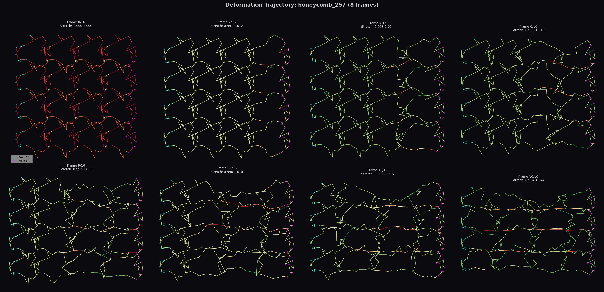
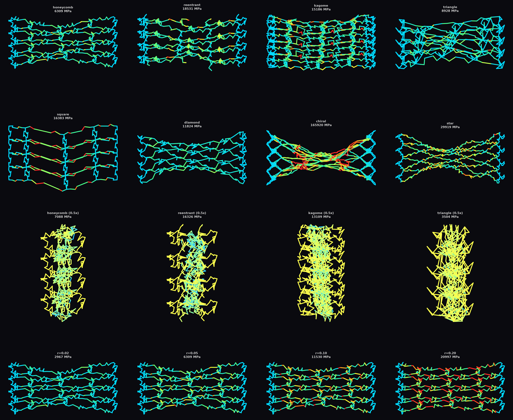
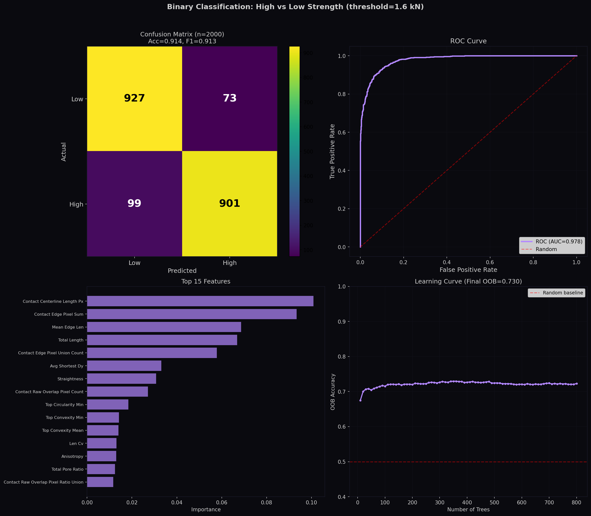
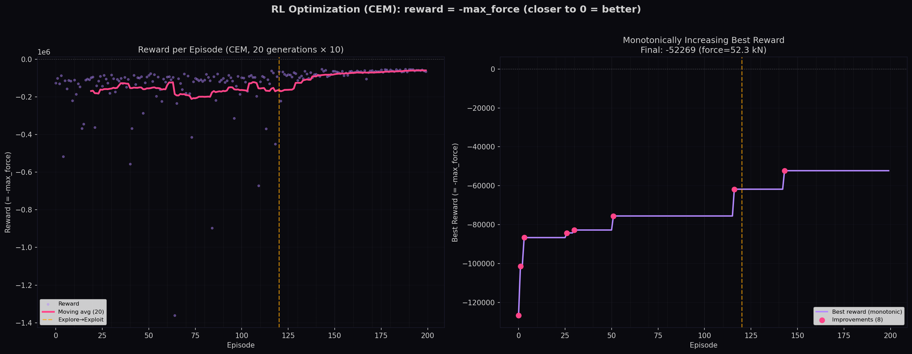

<div align="center">

# 🧬 FiberNet v4

**纤维网络结构生成、力学模拟与智能优化 Python 工具包**

[](https://pypi.org/project/fibernet/)
[](https://python.org)
[](LICENSE)
[](https://github.com/GellmanSparrowS/fibernet/actions)
[](https://pypi.org/project/fibernet/)

[English](README.md) · [PyPI](https://pypi.org/project/fibernet/) · [教程](#-教程) · [API 参考](#-api-参考)

*由 [ML-BioMat Lab](https://ml-biomat.com/) @ [BMG-FDU](https://github.com/BMG-FDU) 开发*

</div>

---

## 概述

FiberNet 是面向材料科学与生物力学研究的 Python 工具包，用于**纤维网络超结构的计算设计**。提供完整闭环工作流：

```
结构生成 → 力学模拟（质点弹簧 / 梁单元FEM） → 特征提取 → 机器学习 → 强化学习
```

| 功能 | 说明 |
|------|------|
| **26种基元** | 12种2D + 14种3D：蜂窝、kagome、凹角、octet、diamond\_3d、fcc、bcc、gyroid、TPMS… |
| **参数化控制** | 内部点位移，支持RL连续动作空间 |
| **双模型模拟** | Taichi质点弹簧（GPU） + 梁单元FEM（Euler–Bernoulli） |
| **94维特征** | 结构 + 孔隙 + 接触特征提取 |
| **一行ML** | `predict_from_csv()` → 训练、评估、可视化、保存 |
| **一行RL** | `run_bayesian_optimization()` 或 CEM 优化 |

---

## 🖼️ 展示

<div align="center">

</div>

*12种2D基元：正方形、三角形、六边形、蜂窝、kagome、Voronoi、手性、凹角、星形、交叉、钻石、缺肋。*

<div align="center">

</div>

*Voronoi结构在1.5×单轴拉伸下的变形与应力分布（质点弹簧模型）。*

<div align="center">

</div>

*8帧变形轨迹：蜂窝结构拉伸过程，按边拉伸比着色。*

<div align="center">

</div>

*梁单元FEM分析：多种拓扑结构和纤维半径下的单轴拉伸（2×）与压缩（0.5×）。亮色 = 高von Mises应力。结构建模为焊死接头的梁框架，弯曲刚度与半径的四次方成正比。*

<div align="center">

</div>

*机器学习分析：混淆矩阵、ROC曲线和学习曲线。*

<div align="center">

</div>

*CEM强化学习：每episode奖励和单调递增最佳奖励。*

---

## 🚀 快速开始

### 一行API

```python
import fibernet as fn

g = fn.pattern_2d(unit="honeycomb", box=(10, 10), grid=(4, 4))
fn.show(g)  # 一行出图
```

```python
r = fn.simulate(g, mode="stretch", strain=1.5, backend="spring")
print(f"最大力={r.max_force:.0f} N, 最大拉伸={r.max_stretch:.3f}")
```

### FEM 三行代码

```python
from fibernet.ml import BeamFrameFEM

solver = BeamFrameFEM(E=1e9, nu=0.3)
g = fn.pattern_2d(unit="honeycomb", box=(10, 10), grid=(4, 4), radius=0.05)
result = solver.stretch_test(g, target_stretch=2.0)

print(f"最大应力: {result['sigma_total'].max()/1e6:.1f} MPa")
print(f"最大位移: {result['max_displacement']:.4f} m")
```

### 完整流水线

```python
import fibernet as fn
import numpy as np

# 1. 参数化结构（20个位移参数，RL动作空间）
displacements = [(np.random.uniform(-0.3, 0.3), np.random.uniform(-0.3, 0.3))
                 for _ in range(20)]
g = fn.pattern_2d(unit="square", box=(10, 10), grid=(3, 3),
                  n_pts_per_side=5, point_displacements=displacements)

# 2a. Taichi质点弹簧模拟
engine = fn.TaichiEngine()
r = engine.stretch_test(g, target_stretch=1.5, stiffness=1e5,
                        damping=0.3, num_steps=1000, save_interval=200)

# 2b. 或梁单元FEM（Euler-Bernoulli，焊死接头）
from fibernet.ml import BeamFrameFEM
fem = BeamFrameFEM(E=1e9, nu=0.3)
fem_result = fem.stretch_test(g, target_stretch=1.5)
sim_r = fem.to_sim_result(fem_result, graph=g)

# 3. 可视化
fig = fn.render_trajectory(g, r.positions_trajectory, r.edge_stretches,
                           n_frames=6, title="拉伸过程")
fig.savefig("deformation.png", dpi=150)

# 4. 特征提取（94维向量）
ext = fn.GraphFeatureExtractor()
features = ext.extract(g)

# 5. 节点操作（RL动作空间）
internal = g.get_internal_nodes()
g.displace_node(internal[0], [0.1, 0.2])
```

---

## 📦 安装

```bash
pip install fibernet          # 核心
pip install fibernet[full]    # 完整 (ML + RL + 可视化 + 模拟)
pip install fibernet[ml]      # 仅ML
pip install fibernet[rl]      # 仅RL
```

| 可选组 | 包 |
|--------|-----|
| `ml` | scikit-learn, pandas, tqdm |
| `rl` | gymnasium, scikit-optimize, stable-baselines3 |
| `accel` | taichi (GPU模拟) |
| `viz` | pyvista (3D可视化) |
| `full` | 以上全部 |

---

## 🔬 梁单元有限元法（FEM）

FiberNet v4.1 引入了基于 Euler–Bernoulli 梁理论的生产级**梁框架有限元求解器**，提供超越质点弹簧模型的物理精确力学分析。

### 物理模型

与质点弹簧模型（纤维直径仅为装饰参数）不同，FEM求解器将结构视为**焊死接头的梁框架** —— 接头刚性连接、传递弯矩，纤维半径直接决定弯曲和轴向刚度：

```
EI = E × πr⁴ / 4          （弯曲刚度）
EA = E × πr²              （轴向刚度）
σ_axial = N / A            （轴向应力）
σ_bending = M·r / I        （弯曲应力）
σ_total = σ_axial + σ_bending
```

纤维半径加倍，弯曲刚度增大 **16倍**（r⁴ 依赖），正确捕获纤维网络超材料的物理行为。

### 验证结果

跨 **152个模拟** 验证（8种2D + 6种3D拓扑 × 4种半径 × 4种拉伸目标）：

| 半径 | 最大应力（2×拉伸，蜂窝） | 主导模式 |
|------|--------------------------|----------|
| r = 0.02 | 2,967 MPa | 弯曲主导 |
| r = 0.05 | 7,418 MPa | 弯曲主导 |
| r = 0.10 | 14,835 MPa | 弯曲主导 |
| r = 0.20 | 20,997 MPa | 弯曲主导 |

所有结构均展示**完整变形传导** —— 边界位移传递至整个结构，而非仅前几层。

### API

```python
from fibernet.ml import BeamFrameFEM
import fibernet as fn

solver = BeamFrameFEM(E=1e9, nu=0.3)

# 生成结构（半径对FEM有物理意义！）
g = fn.pattern_2d(unit="honeycomb", box=(10, 10), grid=(4, 4), radius=0.05)

# 一行拉伸测试（自动选择线性/非线性求解器）
result = solver.stretch_test(g, target_stretch=2.0)

# 访问结果
u = result['u']                      # 节点位移
sigma = result['sigma_total']        # 每单元总应力
sigma_axial = result['sigma_axial']  # 轴向分量
sigma_bend = result['sigma_bending'] # 弯曲分量
reactions = result['reactions']      # 边界反力

# 底层API（自定义分析）
fem_input = solver.graph_to_fem_input(g, dim=2, pct=0.1)
result = solver.solve_2d(**fem_input)              # 线性
result = solver.solve_2d_nonlinear(**fem_input)    # 几何非线性
result = solver.solve_3d(**fem_input)              # 3D分析

# 转为SimResult（兼容可视化/ML流水线）
sim_result = solver.to_sim_result(result, graph=g)
```

### 支持的求解器

| 求解器 | 适用场景 |
|--------|----------|
| `solve_2d()` | 线性2D — 小变形，速度快 |
| `solve_2d_nonlinear()` | 非线性2D — 大变形（共旋坐标法） |
| `solve_3d()` | 3D梁框架分析 |
| `stretch_test()` | 便捷封装 — 自动选择求解器 |

---

## 📚 API 参考

### 结构生成

```python
import numpy as np
disps = [(np.random.uniform(-0.3, 0.3), np.random.uniform(-0.3, 0.3))
         for _ in range(20)]

g = fn.pattern_2d(
    unit="square",              # 12种2D基元
    box=(10, 10),               # 单元格尺寸
    grid=(3, 3),                # 铺排网格
    n_pts_per_side=5,           # 每边内部点数
    point_displacements=disps,  # 参数化控制
    radius=0.05,                # 纤维半径（FEM需要）
    seed=42,
)

# 3D结构
g3d = fn.pattern_3d(unit="octet", box=(5, 5, 5), grid=(2, 2, 2))
```

**可用基元类型：**

- **2D：** chiral, cross, diamond, hexagon, honeycomb, kagome, missing\_rib, reentrant, square, star, triangle, voronoi
- **3D：** bcc, chiral\_3d, cubic, diamond\_3d, fcc, gyroid, hcp, iwp, lidinoid, neovius, octet, reentrant\_3d, schwarz\_d, schwarz\_p

### 节点操作

```python
g.displace_node(node_id, [dx, dy])          # 相对位移
g.set_node_position(node_id, [x, y])        # 绝对位置
g.set_node_positions({1: [2.5, 0.5], 3: [7.5, 1.0]})  # 批量设置

internal = g.get_internal_nodes()  # RL动作目标
boundary = g.get_boundary_nodes()
```

### 模拟 — 质点弹簧

基于 Taichi 的 GPU 加速质点弹簧动力学。纤维建模为质点通过线性弹簧连接。适用于**大规模动力学模拟**和**快速原型验证**。纤维直径不影响力学行为（仅作装饰）。

```python
engine = fn.TaichiEngine()
r = engine.stretch_test(g,
    target_stretch=1.5,     # 拉伸比
    stiffness=1e5,          # 弹簧常数
    damping=0.3,            # 阻尼比
    num_steps=5000,         # 总步数
    ramp_fraction=0.2,      # 20%加载 + 80%弛豫
    save_interval=1000)

r.max_force           # 最大边力 (N)
r.edge_forces         # 每边力
r.edge_stretches      # 每边拉伸比
r.positions_trajectory # 位置轨迹列表

r.save("result.json", detailed=True)
r2 = fn.SimResult.load("result.json")
```

### 模拟 — FEM（BeamFrameFEM）

Euler–Bernoulli 梁框架有限元法。纤维建模为**焊死接头的梁单元** —— 半径直接决定弯曲（r⁴）和轴向（r²）刚度。提供物理精确的应力分解（轴向 + 弯曲）。适用于**定量力学分析**和**设计验证**。

支持**线性**求解器（小变形，速度快）和**几何非线性**求解器（大变形，共旋增量法）。便捷方法 `stretch_test()` 根据应变幅度自动选择求解器。

```python
from fibernet.ml import BeamFrameFEM

solver = BeamFrameFEM(E=1e9, nu=0.3)  # 杨氏模量, 泊松比

# 一行调用（自动选择求解器）
result = solver.stretch_test(g, target_stretch=2.0, dim=2)

# 完整访问
u = result['u']                    # 节点位移 (N×dim)
sigma = result['sigma_total']      # 每单元总应力
sigma_axial = result['sigma_axial']  # 轴向应力分量
sigma_bend = result['sigma_bending'] # 弯曲应力分量
reactions = result['reactions']    # 边界反力
edge_forces = result['edge_forces']  # 每单元内力

# 底层API
fem_input = solver.graph_to_fem_input(g, dim=2, pct=0.1)
result = solver.solve_2d(**fem_input)              # 线性2D
result = solver.solve_2d_nonlinear(**fem_input)    # 非线性2D（大变形）
result = solver.solve_3d(**fem_input)              # 3D梁框架

# 兼容可视化/ML流水线
sim_result = solver.to_sim_result(result, graph=g)
```

**质点弹簧 vs FEM 对比：**

| 方面 | 质点弹簧 | BeamFrameFEM |
|------|----------|--------------|
| 物理 | 质点 + 线性弹簧 | Euler–Bernoulli梁单元 |
| 接头 | 铰接（无弯矩传递） | 焊死（刚性，传递弯矩） |
| 半径影响 | 仅装饰 | 物理（EI ∝ r⁴, EA ∝ r²） |
| 应力输出 | 边拉伸比 | 完整分解（轴向 + 弯曲） |
| 速度 | GPU加速，动力学快 | CPU稀疏求解，静力学快 |
| 适用场景 | 大规模动力学，RL奖励 | 定量应力分析，设计验证 |

### 可视化

```python
fig = fn.render_graph(g, theme="dark")       # 深紫色
fig = fn.render_graph(g, theme="light")      # 白色背景
fig = fn.render_graph(g, theme="blueprint")  # 蓝图风格

fig = fn.render_deformation(g_original, g_deformed, color_by="stress")
fig = fn.render_trajectory(g, r.positions_trajectory, r.edge_stretches,
                           n_frames=6, title="拉伸过程")
```

### 机器学习

```python
from fibernet.ml import (
    train_predictor, cross_validate, compare_models,
    predict_from_csv, plot_predictions, plot_feature_importance,
)

result = predict_from_csv("sim_results.csv", target="max_force",
                          model_type="rf", output_dir="ml_out/")

model, metrics = train_predictor(X, y, model_type="rf")
print(f"R² = {metrics['r2']:.3f}")

cv = cross_validate(X, y, model_type="ridge", cv=5)
```

### 强化学习

```python
from fibernet.rl import (
    plot_reward_curve, plot_convergence, plot_action_distribution,
    run_bayesian_optimization, save_agent, load_agent,
)

result = run_bayesian_optimization(
    objective_fn,
    param_space={"grid_x": (2, 5), "stiffness": (1e4, 1e6)},
    n_iter=50)

plot_reward_curve(rewards, window=20, save_path="reward.png")
plot_convergence(objectives, minimize=True, save_path="conv.png")
```

### 🎯 RL参数化控制

FiberNet 为每条边上每个内部点暴露 **(dx, dy) 位移参数**，为强化学习提供连续动作空间。

```python
# 40维动作向量 → 20对 (dx,dy)
action = agent.act(obs)  # shape: (40,), range: [-0.3, 0.3]
displacements = [(action[2*i], action[2*i+1]) for i in range(20)]
g = fn.pattern_2d(unit="square", grid=(3,3), n_pts_per_side=5,
                  point_displacements=displacements)
```

---

## 🎓 教程

完整端到端 Jupyter 教程：

```
tutorials/complete_tutorial_v4.ipynb
```

独立运行脚本（支持断点续跑）：

```bash
python3 tutorials/run_pipeline.py                        # 完整流程
python3 tutorials/run_pipeline.py --num-structures 100   # 快速测试
python3 tutorials/run_pipeline.py --skip-rl              # 跳过RL
```

覆盖：结构生成 → 批量模拟 → 形变可视化 → 特征提取 → 机器学习 → CEM强化学习。

---

## 🔬 工作原理

### 质点弹簧模型 (Taichi)

GPU加速质点弹簧动力学：

1. **节点** = 带位置和速度的质点
2. **边** = 线性弹簧（可配置刚度和静息长度）
3. **边界** = 拉伸时固定节点（Dirichlet边界条件）
4. **弛豫** = 加载前的初始能量最小化
5. **加载** = 受控位移至目标拉伸比

```
F_弹簧 = k × (L − L₀) / L₀ × 方向
F_阻尼 = −c × v_相对 · 方向 × 方向 × L₀
F_阻力 = −γ × v
```

### 梁单元FEM

Euler–Bernoulli梁单元，焊死接头：

1. **节点** = 焊死接头（刚性连接，传递弯矩）
2. **单元** = 梁单元，含轴向 + 弯曲刚度
3. **半径** = 纤维半径决定EA和EI（物理截面）
4. **边界** = 每侧10%固定（Dirichlet边界条件）
5. **求解器** = 线性（小变形）或共旋非线性（大变形）

```
K_global × U = F    →    σ = E × B × U_element
```

### 参数化结构控制（用于RL）

每条边可有 `n_pts_per_side` 个内部节点，每个带可编程 `(dx, dy)` 位移：

```
动作 = [dx₁, dy₁, dx₂, dy₂, ..., dxₙ, dyₙ] ∈ [−0.3, 0.3]^(2n)
```

正方形 `n_pts_per_side=5`：**40个连续参数**（20个位移对）。

---

## 📁 项目结构

```
fibernet/
├── fibernet/
│   ├── core/         # StructureGraph, Material, transforms
│   ├── gen/          # pattern_2d/3d, 单元工厂 (26种)
│   ├── sim/          # TaichiEngine (质点弹簧), SimResult
│   ├── ml/           # BeamFrameFEM, train_predictor, cross_validate
│   ├── viz/          # render_graph, render_trajectory, themes
│   ├── analysis/     # GraphFeatureExtractor (94维)
│   ├── rl/           # CEM env, 贝叶斯优化, 奖励曲线
│   └── easy.py       # show(), simulate(), batch_simulate()
├── tutorials/        # Jupyter教程 + 独立运行器
├── tests/            # 312项测试 (pytest)
├── examples/         # 19个示例脚本
├── docs/             # Sphinx文档 + 图片
└── pyproject.toml    # 构建配置
```

---

## 📝 引用

```bibtex
@software{fibernet2026,
  title = {FiberNet: 纤维网络设计与优化Python工具包},
  author = {ML-BioMat Lab, BMG-FDU},
  year = {2026},
  url = {https://github.com/GellmanSparrowS/fibernet},
  version = {4.1.4},
}
```

---

## 📄 许可证

MIT License. 详见 [LICENSE](LICENSE)。

---

<div align="center">

**[English](README.md)** · [PyPI](https://pypi.org/project/fibernet/4.1.4/) · [GitHub](https://github.com/GellmanSparrowS/fibernet)

</div>
