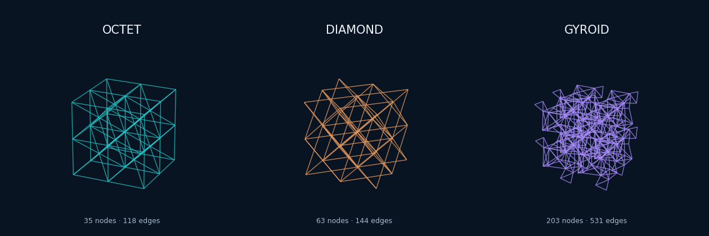

[English homepage](README.md#quick-start)

# FiberNet 中文指南

<!-- locale:zh:start -->
## 快速开始

需要 Python 3.9 或更高版本。安装 [PyPI 正式版](https://pypi.org/project/fibernet/) 后即可运行内置示例，不用下载源码、准备输入文件或使用 GPU。

```bash
python -m pip install fibernet
python -m fibernet.examples.basic_usage --output-dir fibernet_demo
```

示例会生成纤维网络，计算小变形响应，并保存结构、图片和模拟结果。

<details>
<summary>从源码运行仓库里的算例</summary>

**开发版源码：4.24.0**

```bash
git clone https://github.com/GellmanSparrowS/fibernet.git
cd fibernet
python -m pip install -e .
python -m examples.open_source_workflow --output-dir demo_output
```

其他流程和可选依赖见[算例索引](examples/README.md)。仓库算例可能比 PyPI 正式版更新。

</details>

## 按研究问题选算例

- **生成二维或三维纤维网络**：[生成参数与示例](docs/METHODS_3D_GENERATION_PARAMETERS.md)
- **算变形、比较材料，或模拟熔合接点**：[梁模型](docs/API_LAYERS.md) · [三维实体力学](docs/TET4_STATIC.md)
- **看整个三维网络受力后电阻怎么变**：[360 杆三维力电算例](docs/DEFORMED_TRANSPORT_PREPARATION.md)
- **分析网络、构建数据集或训练代理模型**：[网络分析](examples/snapshot_features_workflow.py) · [物理量学习流程](examples/physical_learning_workflow.py)
- **沿用同一个 `StructureGraph` 导出制造路径**：[闭合路径](docs/MANUFACTURING_GRAPH_MAPPING.md) · [多段路径](docs/MULTISTROKE_MANUFACTURING.md)

力电算例在变形后的几何上重算电阻，不包含材料本征压阻，也不把电学结果反馈给力学。其他模块见[功能与接口导航](docs/api/WORKFLOW_MAP.md)。



*从不同角度看 octet、diamond 和 gyroid 网络。[更多动图及来源](docs/MEDIA_GALLERY.md)。*

## FiberScope 桌面应用

[下载 FiberScope Windows x64 版](https://github.com/GellmanSparrowS/fibernet/releases/tag/v4.2.0) · [桌面指南](FiberScope/README.md)

完整解压 ZIP 后打开 `FiberScope.exe`。桌面程序和 Python 包独立安装。

[更新记录](CHANGELOG.md) · [参与贡献](.github/CONTRIBUTING.md) · [MIT 许可证](LICENSE)
<!-- locale:zh:end -->
